# Toegankelijkheid testen

## Disclaimer

De tips in dit document vervangen geen officiële toegankelijkheidsaudit. Ze helpen alleen om snel opvallende problemen met toegankelijkheid en gebruiksvriendelijkheid te herkennen.

## Waarom toegankelijk?

Toegankelijke websites zijn voor iedereen bruikbaar, ook voor mensen met een beperking – of die nu visueel, motorisch, auditief of cognitief is.

Als overheid hebben we de verantwoordelijkheid om producten en diensten te bieden die voor iedereen toegankelijk, begrijpelijk en bruikbaar zijn. Niet alleen omdat iedereen het recht heeft om digitaal mee te doen en zaken met de overheid te regelen, maar ook [vanwege wettelijke verplichtingen](#wetgeving).

Een toegankelijke website is dus niet alleen inclusief, maar ook praktisch. Zo kunnen zoekmachines – net als blinde gebruikers – de inhoud beter lezen en indexeren.

### WCAG

De *Web Content Accessibility Guidelines* (WCAG) zijn internationale richtlijnen om webinhoud toegankelijk te maken.  Ze zijn opgesteld door het [World Wide Web Consortium (W3C)](https://www.w3.org/) en zijn gebaseerd op vier principes:

* waarneembaar,
* bedienbaar,
* begrijpelijk en
* robuust

> In het Engels POUR: **P**erceivable, **O**perable, **U**nderstandable, **R**obust.

[De European Accessibility Act](https://commission.europa.eu/strategy-and-policy/policies/justice-and-fundamental-rights/disability/union-equality-strategy-rights-persons-disabilities-2021-2030/european-accessibility-act_en?prefLang=nl) refereert specifiek naar [WCAG versie 2.1 niveau AA](), alhoewel versie 2.2 momenteel (ook) nog in *Recommendation* fase is, is het verstandig om te zorgen ook aan [versie 2.2 niveau AA](https://www.w3.org/Translations/WCAG22-nl/) te voldoen.

[De European Accessibility Act]((https://commission.europa.eu/strategy-and-policy/policies/justice-and-fundamental-rights/disability/union-equality-strategy-rights-persons-disabilities-2021-2030/european-accessibility-act_en?prefLang=nl)) verwijst specifiek naar WCAG 2.1, niveau AA. Hoewel versie 2.2 op dit moment nog in de aanbevelingsfase zit, is het verstandig om aan [WCAG 2.2 niveau AA](https://www.w3.org/Translations/WCAG22-nl/) te voldoen.

### ARIA

[Accessible Rich Internet Applications (ARIA)](https://www.w3.org/WAI/standards-guidelines/aria/) is een specificatie van het W3C die helpt om interactieve webinhoud toegankelijk te maken voor mensen met een beperking. Met ARIA-attributen kun je extra informatie en rolbeschrijvingen toevoegen aan HTML-elementen, zodat screenreaders complexe interfaces beter begrijpen.

Let op: veel van deze toegankelijkheidsinformatie is al standaard aanwezig in correct toegepaste, semantische HTML-elementen. Verkeerd gebruik van ARIA kan juist voor méér problemen zorgen en de toegankelijkheid verslechteren.

Daarom geldt vaak de ongeschreven regel: “*The first rule of ARIA is: Don’t use ARIA.*”, Of iets genuanceerder: *[If you can use a native HTML element or attribute with the semantics and behavior you require already built in, instead of re-purposing an element and adding an ARIA role, state or property to make it accessible, then do so.](https://www.w3.org/TR/using-aria/#rule1)*”

### Wetgeving

#### Implementatiewet toegankelijkheidsvoorschriften producten en diensten

> “*Met deze implementatiewet wordt de Europese Richtlijn met betrekking tot de toegankelijkheidsvoorschriften voor producten en diensten verankerd in de Nederlandse wetgeving.*”

[Implementatiewet toegankelijkheidsvoorschriften producten en diensten](https://www.eerstekamer.nl/wetsvoorstel/36380_implementatiewet)

#### European Accessibility Act

[De European Accessibility Act](https://commission.europa.eu/strategy-and-policy/policies/justice-and-fundamental-rights/disability/union-equality-strategy-rights-persons-disabilities-2021-2030/european-accessibility-act_en?prefLang=nl), goedgekeurd in 2019, is een EU-richtlijn die lidstaten verplicht om digitale en fysieke producten en diensten toegankelijk te maken voor mensen met een beperking. De wet stelt onder andere eisen aan de toegankelijkheid van websites en mobiele apps, en treedt op 28 juni 2025 in werking.

## (Automatisch) testen in de browser

Er zijn verschillende extensies beschikbaar om direct in de browser te testen. De onderstaande extensies zijn geschikt voor Chromium-gebaseerde browsers, zoals:

* Google Chrome
* Microsoft Edge
* Brave
* Chromium
* Opera

Er zijn verschillende browserextensies beschikbaar die (gedeeltelijk automatisch) toegankelijkheidsaspecten testen. Omdat ze vaak verschillende resultaten geven, is het verstandig om meerdere extensies te gebruiken en de uitkomsten kritisch te beoordelen.

Sommige aspecten zijn goed automatisch te testen, zoals het ontbreken van alternatieve tekst bij afbeeldingen, kleurcontrast en een juiste documentstructuur. Andere onderdelen – zoals het correct gebruik van [HTML-semantiek](https://html.spec.whatwg.org/multipage/dom.html#semantics-2) of begrijpelijk (B1) taalgebruik – zijn moeilijk automatisch te controleren en vragen om handmatige beoordeling.

Test worden vrijwel altijd uitgevoerd op individuele pagina’s, niet een gehele site.

### WAVE

[WAVE](https://wave.webaim.org/extension/) van [WebAIM](https://webaim.org/) geeft een overzicht van toegankelijkheid fouten en waarschuwingen op een pagina. Daarnaast geeft het ook correcte implementatie weer zoals de koptekst-structuur en de aanwezigheid van tekst-alternatieven voor afbeeldingen [^alt-text].

[^alt-text]: De juiste beschrijving van afbeeldingen wordt uiteraard niet getest.

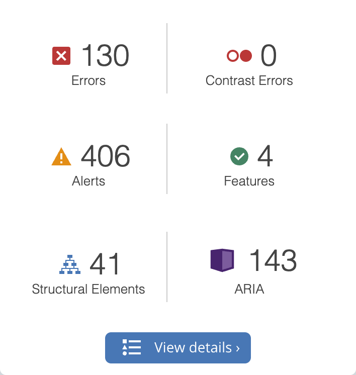

<small>Bijschrift: [Deze pagina](https://kwiv.rijksapplicaties.nl/profielen/profiel-zoeken) bevat 130 toegankelijkheidsfouten en 406 waarschuwingen.</small>

Door op *View details* te klikken krijg je een overzicht van de fouten en waarschuwingen met individuele links naar specifieke problemen (*Features* en *ARIA* kunnen in deze context genegeerd worden).

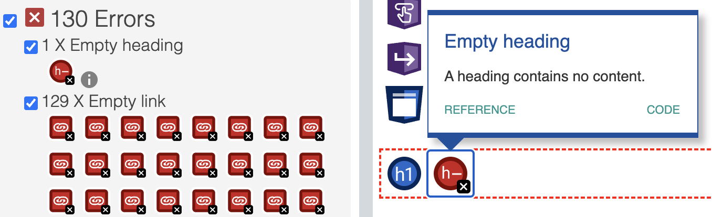

<small>Bijschrift: Deze specifieke detailmelding geeft aan dat een koptekst (heading) geen tekst bevat..</small>

Deze extensie stuurt geen data naar derde partijen en kan hierdoor gebruikt worden voor projecten die nog niet opgeleverd zijn of alleen beschikbaar binnen het Rijksoverheid netwerk.

> Tip: Het uitzetten van de CSS stylesheet(s) d.m.v. de switch *Styles* op *Off* te zetten geeft de paginainhoud weer zoals bijvoorbeeld een screenreader of een zoekmachine deze interpreteert.
> 

[WAVE Browser Extensions](https://wave.webaim.org/extension/)

### BrowserStack Accessibility Toolkit

ℹ️ Om deze extensie te gebruiken is een account nodig. De gratis versie maakt het mogelijk vijf pagina’s per kalendermaand te scannen.

Accessibility Toolkit voegt functionaliteit toe aan DevTools. Het is dus nodig om DevTools te openen om met deze extensie te werken.

Deze extensie maakt het mogelijk om tevens op basis van pagina-interactie (door het navigeren op de pagina, acties activeren, etc.) een inventarisatie te maken.

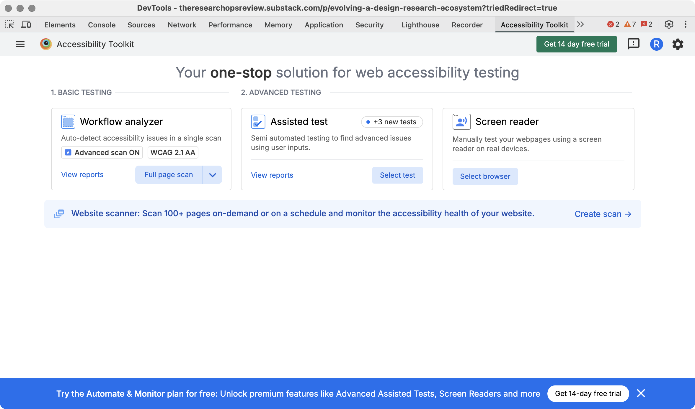

Selecteer in DevTools het tabblad *Accessibility Toolkit* en klik op *Full page scan*.

Door na de resultaten te ‘interacteren’ op de pagina kunnen ook dingen als menu’s, knoppen-staten, uitklapmechanismes, etc. gevalideerd worden.

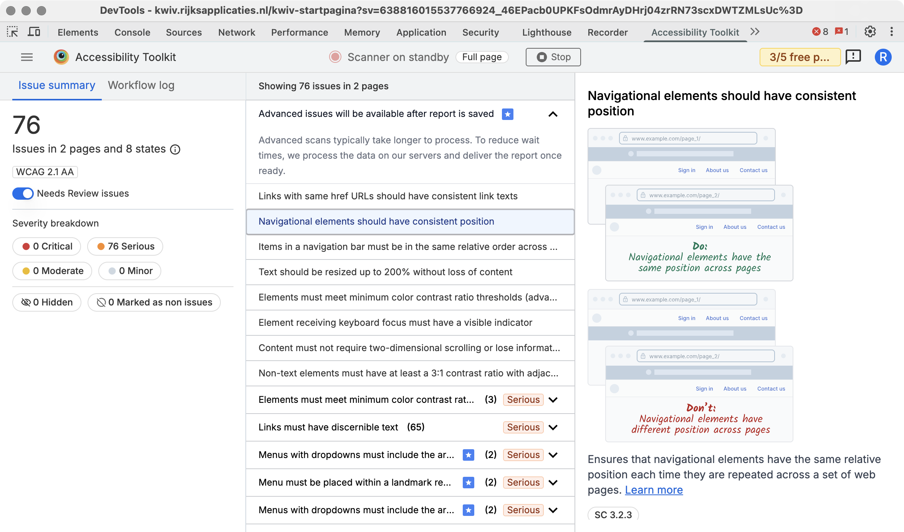

[BrowserStack Accessibility Toolkit](https://www.browserstack.com/docs/accessibility/overview/install-browser-extension)

### Accessible Web Helper

[Accessible Web Helper](https://accessibleweb.com/web-accessibility-checker-browser-extension/) is een andere extensie die een automatisch rapport genereert met een overzicht van toegankelijkheidsproblemen.

Klik onder *Page Scanner* de optie *Scan Page* en zorg dat *Ruleset* WCAG 2.2 AA geselecteerd is. Klik vervolgens op *Scan Page* om een rapport te genereren.

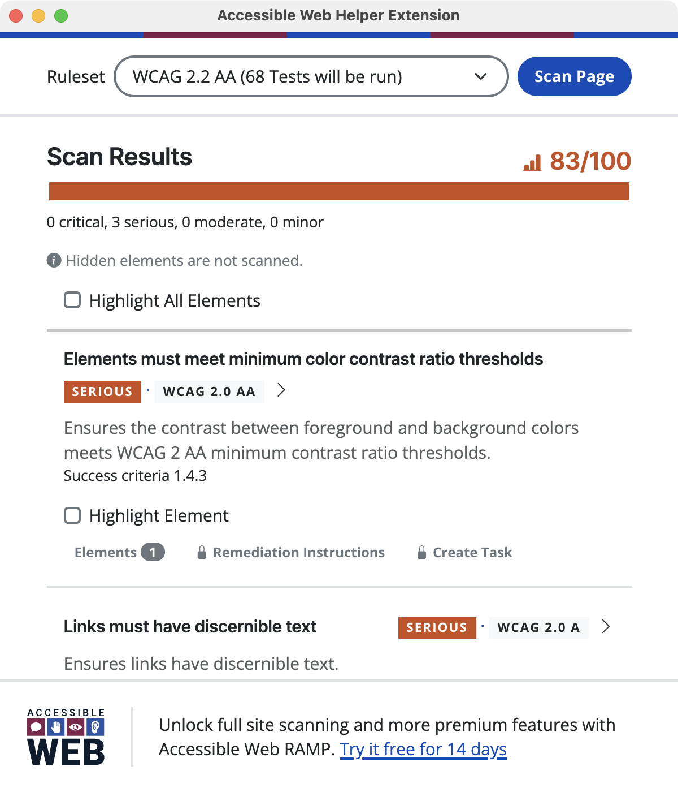

<small>Bijschrift: Accessible Web Helper resultaten [van een specifieke pagina](https://kwiv.rijksapplicaties.nl/profielen/profiel-zoeken).</small>

[Accessible Web Helper in de Chrome Web Store](https://chromewebstore.google.com/detail/accessible-web-helper/gdnpkbipbholkoaggmlblpbmgemddbgb)

### HalfAccessible - Accessibility Toolkit

Deze extensie is voornamelijk handig om de *Target size* van interactieve elementen te controleren. Activeer onder *Tools* → *Target size*. Door met de muis over een interactief element te bewegen is het oppervlakte te zien.

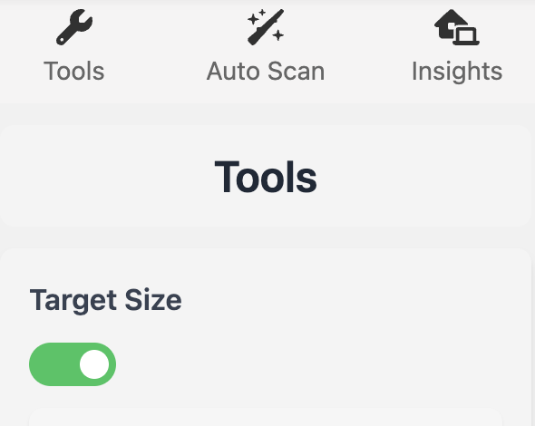

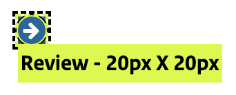

<small>Bijschrift: Een interactief element met onvoldoende klikoppervlak.</small>

Een interactief element (link of uitvoeren van een actie) dient [minimaal 24 × 24 pixels te zijn](#targetsize).

*Auto Scan* biedt ook de mogelijkheid om een automatische test uit te voeren via *Auto Scan* → *Automated Issues*. Deze functie laat goed zien dat geen enkele tool alle toegankelijkheidsproblemen automatisch kan opsporen. De resultaten kunnen sterk afwijken van die van andere testtools.

[HalfAccessible - Accessibility Toolkit in de Chrome Web Store](https://chromewebstore.google.com/detail/halfaccessible-accessibil/kofnlhenkilpdacklecdifdfigomanje)

### DigitalA11Y Tublets

Met deze extensie kun je direct op een webpagina verschillende HTML-elementen en attributen bekijken, inclusief ARIA-gebruik en de tabvolgorde (de volgorde die een toetsenbordgebruiker ervaart).

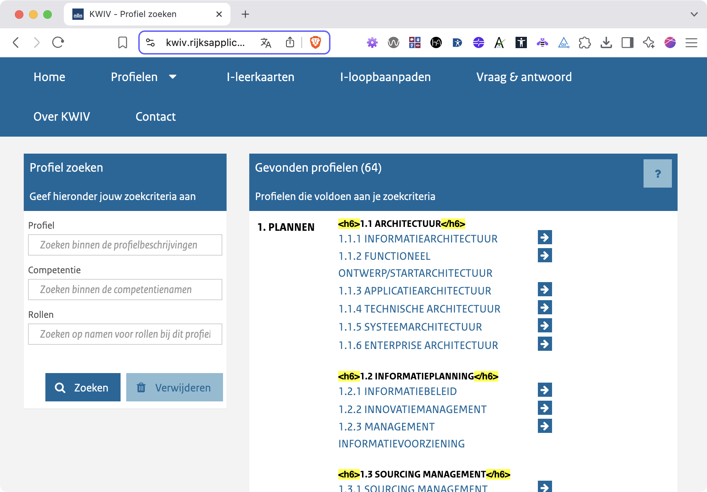

<small>Bijschrift: Tublets laat hier zien dat alleen koppen van niveau 6 worden gebruikt, [zonder een correcte structuur of logische volgorde](https://www.a11yproject.com/posts/how-to-accessible-heading-structure/).</small>

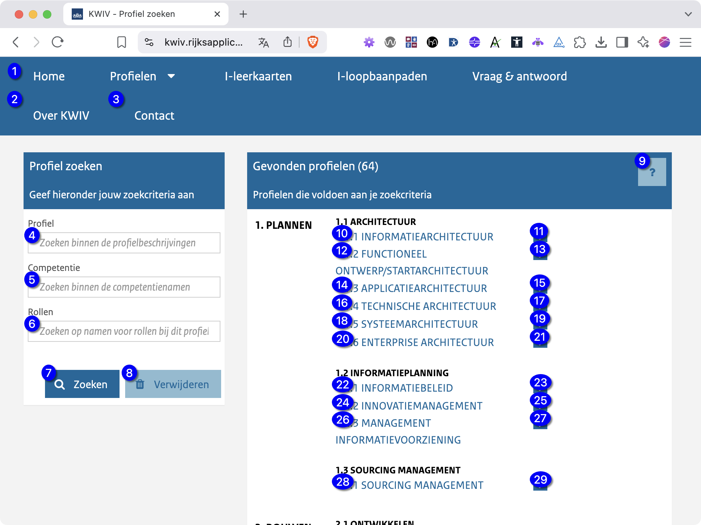

<small>Bijschrift: Tabvolgorde: 1 geeft aan welk element als eerste focus krijgt met de `Tab`-toets, 2 het volgende, enzovoort.</small>

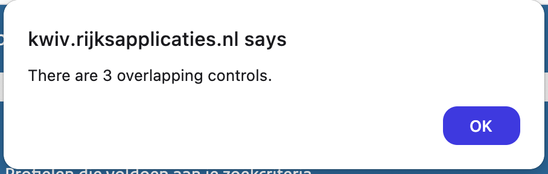

<small>Bijschrift: Met de optie *Touch Target Size* laat Tublets zien of interactieve elementen elkaar overlappen.</small>

[DigitalA11Y Tublets in de Chrome Web Store](https://chromewebstore.google.com/detail/digitala11y-tublets/ccjeccodophadokglbdcinabgkiiakjh)

### BarrierBreak A11yInspect

A11yInspect bundelt meerdere hulpmiddelen (*bookmarklets*) om verschillende toegankelijkheidsaspecten te testen, zoals *landmarks* en *tabvolgorde*.

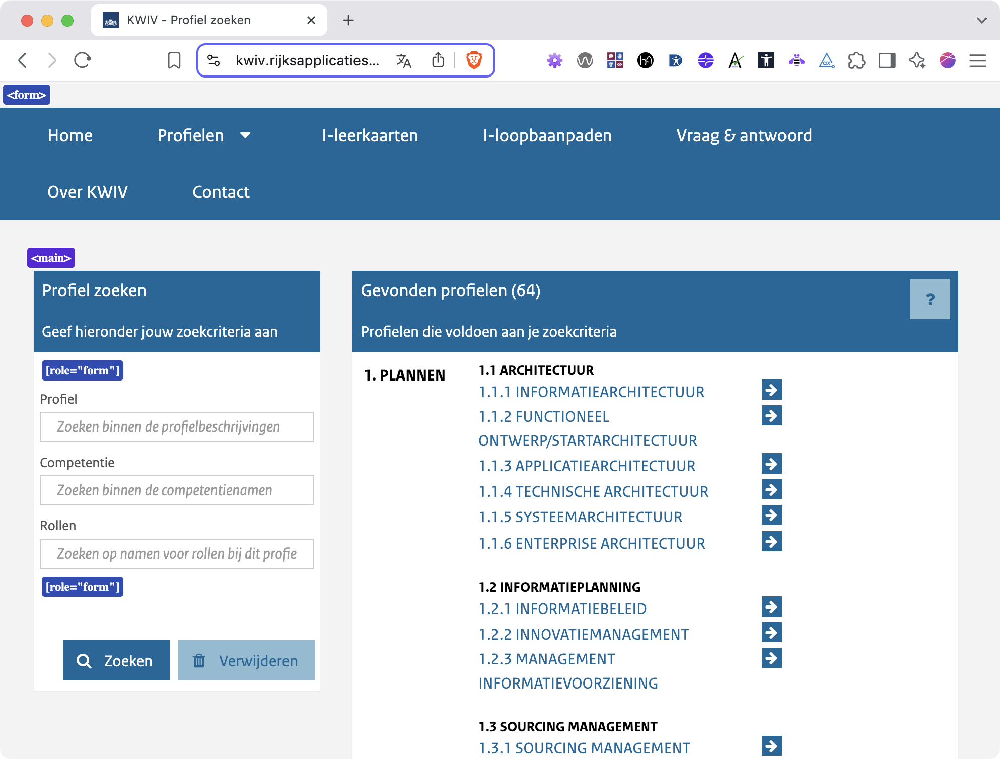

<small>Bijschrift: De optie *Landmarks* toont dat de volledige paginainhoud binnen een `<form>`-element staat. Omdat de pagina geen formulier is, kan dit tot verschillende toegankelijkheidsproblemen leiden.
</small>

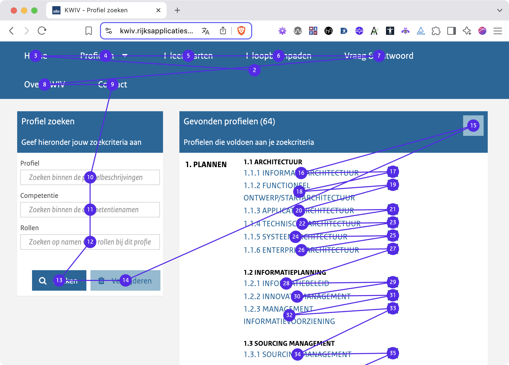

<small>Bijschrift: *Tab Order* laat de volgorde zien waarin een toetsenbordgebruiker met de `Tab`-toets door de pagina navigeert.</small>

[BarrierBreak A11yInspect in de Chrome Web Store](https://chromewebstore.google.com/detail/barrierbreak-a11yinspect/giaolcgipopikbjonacmaokkeiaolmfp)

### DevTools

### Lighthouse

## Handmatig testen

### Taalgebruik

Wordt er gecommuniceerd op een manier die voor iedereen, ongeacht opleidingsniveau, begrijpbaar is?

#### Taalniveau B1

> “[Taalniveau B1](https://www.communicatierijk.nl/vakkennis/rijkswebsites/aanbevolen-richtlijnen/taalniveau-b1) staat voor eenvoudig Nederlands. De overgrote meerderheid van de bevolking begrijpt teksten op taalniveau B1. Ook mensen die geen (hoge) opleiding hebben gehad. Een tekst op B1-niveau bestaat uit makkelijke woorden die bijna iedereen gebruikt. En uit korte, eenvoudige en actieve zinnen.” – [Aanbevolen richtlijnen van CommunicatieRijk](https://www.communicatierijk.nl/vakkennis/rijkswebsites/aanbevolen-richtlijnen)

### ‘Landmarks’

Landmarks, samen met correct gebruik van headings, geven de structuur weer van de pagina. Ze stellen o.a. in staat om snel naar diverse punten in de inhoud te navigeren. Sommige HTML elementen hebben een impliciete ‘landmark role’ en ‘accessible name’. Het is daarom aanbevolen om zo veel mogelijk gebruik te maken van de juiste HTML markup en het gebruik van ARIA te beperken.

Enkele belangrijke HTML elementen met een geimpliceerde ‘role’:

* `<header>` verwijst naar de paginakop, waarin veelal logo, sitenaam en hoofdnavigatie bevindt. [^landmark-usage-amount]
* `<nav>` verwijst naar een lijst met (sub)navigatie opties.
* `<main>` verwijst naar de hoofdinhoud van een pagina. [^landmark-usage-amount]
* `<article>`
* `<section>`
* `<form>` verwijst naar een formulier met invoermogelijkheden
* `<aside>`, secundaire content
* `<footer>`, de pagina footer met veelal links naar contactgegevens, disclaimers, copyright informatie etc. [^landmark-usage-amount]
 
 [^landmark-usage-amount]: Mag slechts eenmaal op een pagina gebruikt worden.

### Skip-links

*Skip links* zijn verborgen links bovenaan een pagina waarmee gebruikers direct naar de hoofdinhoud kunnen springen. Zo kunnen ze repeterende onderdelen, zoals de paginakop en navigatie, overslaan.

De meeste screenreaders bieden standaard een manier om snel naar de hoofdinhoud te springen. Voor toetsenbordgebruikers zonder screenreader zijn skip links echter essentieel voor efficiënte navigatie. Deze link moet zichtbaar worden zodra hij focus krijgt, en als eerste in de tabvolgorde staan.

### Toetsenbordnavigatie controleren

De extensie BarrierBreak A11yInspect kan de tab volgorde visualiseren.  

### Gebruik screenreader-software

Screenreading-software maakt het mogelijk om de inhoud van een webpagina voor te laten lezen. Daarnaast biedt het vaak functies om herhalende onderdelen, zoals de hoofdnavigatie, over te slaan.

Gebruikers hebben meestal hun eigen voorkeuren, zoals de snelheid waarmee de tekst wordt voorgelezen.

### In- en uitzoomen

> “Behalve voor ondertitels voor doven en slechthorenden en afbeeldingen van tekst, kan tekst zonder hulptechnologie tot 200% geschaald worden zonder verlies van content of functionaliteit.”

[WCAG 2.2 AA Succescriterium 1.4.4 Herschalen van tekst](https://www.w3.org/Translations/WCAG22-nl/#resize-text)

#### Zoom in op een pagina

Bij het inzoomen op een pagina wordt alles, inclusief tekst, afbeeldingen, knoppen en lay-out-elementen vergroot.

Een pagina dient goed te werken wanneer deze tot 200% vergroot is zonder verlies van content of functionaliteit.

* `Command` + `+`: Inzoomen
* `Command` + `-`: Uitzoomen
* `Command` + `0`: 100% zoomniveau

<small>Op Windows gebruik je in plaats van de `Command` toets `CTRL`.</small>

#### Tekst vergroten

Er is een belangrijk verschil tussen het vergroten van een pagina en van tekst. Bij het vergroten van tekst worden **alleen** tekstelementen op de pagina vergroot; andere elementen zoals knoppen, afbeeldingen en containers blijven ongewijzigd.

Ook bij enkel het vergroten van tekst dient de pagina goed te werken wanneer deze tot 200% vergroot is zonder verlies van content of functionaliteit.

In Chromium-browsers:

1.	Klik op het menu rechtboven op *[Instellingen](chrome://settings)* (of *[Settings](chrome://settings)*).
1.	Ga naar *Uiterlijk* (of *“Appearance”*).
1.	Zoek de optie *Lettergrootte* of *Font size*.
1.	Kies *Groot* (*Large*), *Zeer groot* (*Very large*), of een aangepaste waarde via *Aangepaste lettertypen*.

Indien de tekst op de pagina niet groter wordt zijn er waarschijnlijk geen juiste eenheden voor de tekstgroottes gebruikt. De eenheden voor tekstgrootte zouden relatief mee moeten schalen.

* Pixels (`px`) zijn vaste eenheden, die zich niet (altijd) automatisch aanpassen aan de voorkeuren van de gebruiker en kunnen lay-out problemen veroorzaken bij tekstvergroting.
* `em` en `rem` zijn relatieve eenheden, die zich aanpassen aan de ingestelde basislettergrootte van de browser of het besturingssysteem en schalen beter mee op verschillende schermformaten en resoluties (*Responsive design*).

### Minimale grootte van interactieve elementen

Voor iedereen is het fijn dat een klik- of tap-oppervlakte groot genoeg is om comfortabel met een pagina te interacteren.

Voor mensen met bijvoorbeeld een motorische beperking, denk aan de Ziekte van Parkinson, is een minimum interactief oppervlakte een must.

Volgens [het WCAG2.2 AA succescritrerium 2.5.8 Grootte van het aanwijsgebied (minimum)](https://www.w3.org/Translations/WCAG22-nl/#target-size-minimum) dient dit oppervlak minimaal 24 × 24 pixels te zijn.

### Check kleurcontrast

> Tip: Een snelle manier om contrasten te testen is door de paginakleuren weer te geven in grijstinten.

## Aandachtspunten

### Koptekst-structuur

Kopteksten (headings) waarborgen de juiste informatiestructuur. Mensen die gebruik maken van screenreaders kunnen een overzicht voorgelezen krijgen van deze kopteksten om zo duidelijk de structuur van de pagina te begrijpen. Toetsenbordgebruikers (al dan niet in combinatie met screenreaders) kunnen makkelijk door de hoofdstuctuur van de pagina navigeren.

op een pagina worden in HTML als `<h1>` t/m `<h6>` gedefineerd. 

Koppen op een pagina beginnen altijd op niveau 1. Dit is vaak een titel die de inhoud van betreffende pagina beschrijft. Op niveau 1 volgt 2, dan 3, dan 4, etc. Een niveau mag niet overgeslagen worden.

    <h1>Koptekst niveau 1</h1>
    <h2>Koptekst niveau 2</h2>
    
Paragraaftekst.

    <h3>Een niveau dieper</h3>
    
Paragraaftekst die dieper ingaat op de inhoud van de tekst onder niveau 2.

of:

    <h1>Koptekst niveau 1</h1>
    <h2>Koptekst niveau 2</h2>
    
Paragraaftekst.

    <h2>Koptekst niveau 2</h2>
    
Een volgende koptekst die op hetzelfde niveau als de eerdere staat.

wat niet mag:

    <h1>Koptekst niveau 1</h1>
    <h3>Koptekst niveau 3</h3>

In het laatste voorbeeld wordt een niveau overgeslagen.

## Gebruikerstesten

Het testen met ‘echte’ gebruikers heeft uiteraard de voorkeur. Aangezien er met meerdere, en combinaties van beperkingen rekening gehouden dient te worden is dit echter moeilijk.

## Accessibility audit

Een officiële accessibility audit neemt steekproeven van pagina’s en resulteerd in een uitgebreid rapport van bevindingen en aanbevelingen.

[Onderzoeksrapport leveranciersportaal.rijksinkopen.nl door Cardan](https://leveranciersportaal.rijksinkopen.nl/static/files/193739/inspectie-leveranciersportaalrijksinkopennl-11-2024.pdf)

## Bronnen

### European Accessibility Act

* [European accessibility act](https://commission.europa.eu/strategy-and-policy/policies/justice-and-fundamental-rights/disability/union-equality-strategy-rights-persons-disabilities-2021-2030/european-accessibility-act_en?prefLang=nl)
* [Richtlijn (EU) 2019/882 van het Europees Parlement en de Raad van 17 april 2019 betreffende de toegankelijkheidsvoorschriften voor producten en diensten](https://eur-lex.europa.eu/eli/dir/2019/882)
* [Harmonised European Standard Accessibility requirements for ICT products and services](https://www.etsi.org/deliver/etsi_en/301500_301599/301549/03.02.01_60/en_301549v030201p.pdf) (PDF)
* [Producten en diensten toegankelijker voor mensen met beperking](https://www.rijksoverheid.nl/onderwerpen/leven-met-een-beperking/producten-en-diensten-toegankelijker-voor-mensen-met-beperking)
* [Implementatiewet toegankelijkheidsvoorschriften producten en diensten](https://www.eerstekamer.nl/wetsvoorstel/36380_implementatiewet)
* [European Accessibility Act themasite van Stichting Accessibility](https://www.accessibility.nl/EAA)

### Web Content Accessibility Guidelines (WCAG)

* [Web Content Accessibility Guidelines (WCAG) 2.2
](https://www.w3.org/Translations/WCAG22-nl/), geautoriseerde Nederlandse vertaling van de WCAG 2.2 richtlijnen
* [Richtlijnen voor Toegankelijkheid van Webcontent (WCAG) 2.2](https://wcag.nl/kennis/richtlijnen/wcag-2-2-richtlijnen/), een andere bron voor een Nederlandse versie van WCAG 2.2
* [WCAG compliance checklist (The Accessibility Project)](https://www.a11yproject.com/checklist/)

### HTML-semantiek

* [Semantic Structure: Regions, Headings, and Lists](https://webaim.org/techniques/semanticstructure/)
* [HTML Living Standard 3.2.1 Semantics](https://html.spec.whatwg.org/multipage/dom.html#semantics-2)
* [HTML elements reference (MDN web docs)](https://developer.mozilla.org/en-US/docs/Web/HTML/Reference/Elements)

### Overheid en toegankelijkheid

* [Dashboard DigiToegankelijk](https://dashboard.digitoegankelijk.nl/), een overzicht van de toegankelijkheid van websites en apps van de Nederlandse overheid.
* [Digitale Overheid: Digitale inclusie](https://www.digitaleoverheid.nl/overzicht-van-alle-onderwerpen/digitale-inclusie/)